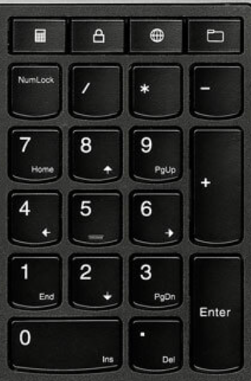
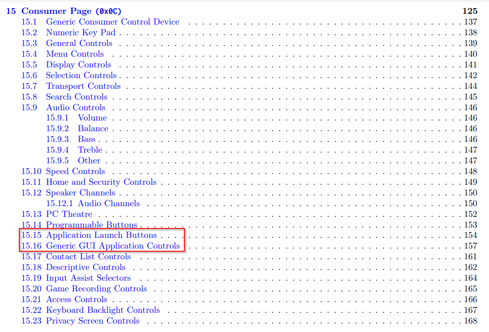
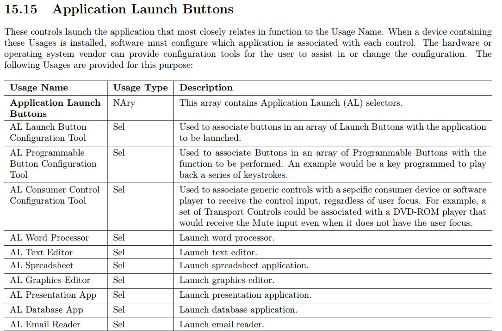
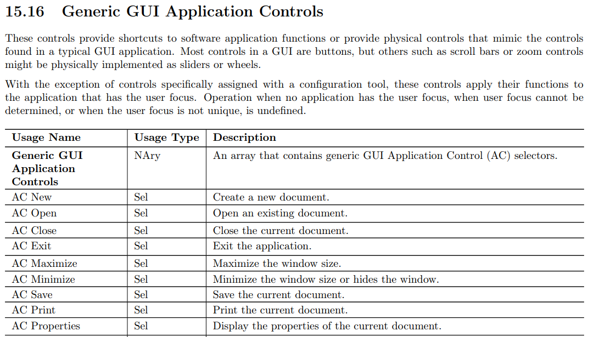
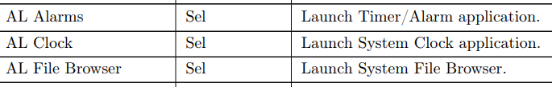
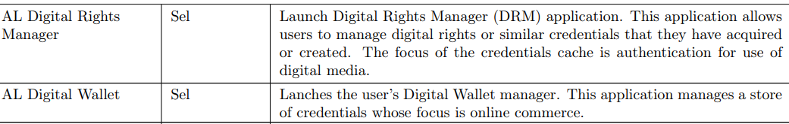
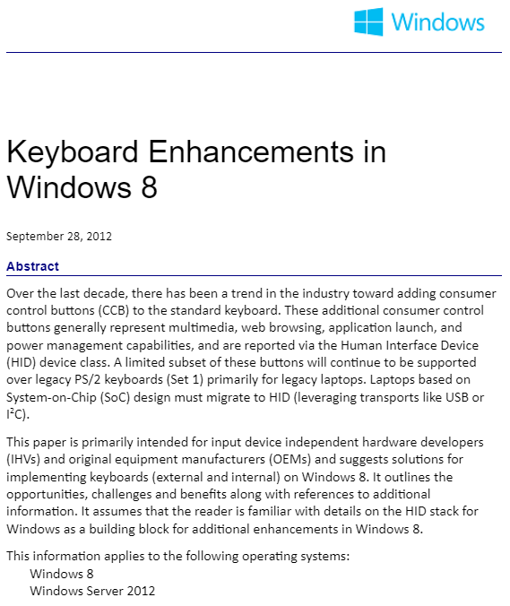
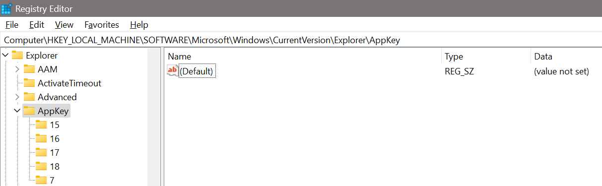

# Background
In early 2023 an awesome colleague ([Andreas](https://linkedin.com/in/aarislarsen/)) spoke about an incident response case featuring thugs plugging a media keyboard into an ATM, and breaking out of its ATM kiosk software to install malware causing it to dispense **$$$**. This prompted me to spend some time during spring and summer of 2023 looking into **Consumer Control**, a subset of USB functionality, which is what allows media keyboards to launch and control various applications over USB with the press of single **buttons**; so called **Consumer Control Buttons** (CCBs). This writeup describes my research on the matter, and what I have nicknamed the **USB HID & Run** attack (credit to [Roman](https://red734.com/) for helping out with the name).  

## Problem
Kiosks are self-contained, stand-alone computer systems designed for public use, usually with a touch screen interface and limited software functions. A sometimes overlooked component of the kiosk security model is the accessibility of USB ports, and whether they are enabled or not.

Kiosks are attractive targets for attackers because they are easily accessible, and can in some instances be connected to internal networks (other times they contain lots of cash, as in the case of an ATM). 

Thus, breaking out of a kiosk with the aim of executing arbitrary code can be an effective entrypoint into an organization's network (or to get the money out of the ATM). An attacker with access to the USB port of the kiosk, could potentially leverage this access to break out of the kiosk using keyboard shortcuts or CCBs.

No information regarding the use of CCBs for attacking kiosks, or defending kiosks from such attacks specifically, was readily available when I started this research. I aimed to address and fill this knowledge gap through further investigation.

## Objectives
The main goal of this research was to enable further research into USB HID & Run attacks. To achieve this, the following objectives were set:

1. Investigate possibilities for emulating CCBs using a commercially available microcontroller
2. Determine whether CCBs are inherently different from built-in Windows keyboard shortcuts (e.g., `Win+E` vs. CCB launching File Explorer)
3. Evaluate the feasibility of using the USB HID & Run attack as a method of launching new applications in kiosks via USB, effectively breaking out of the kiosk.

# Technical Background

## Kiosks
Kiosks are self-contained, stand-alone computer systems designed for public use, usually with a touch screen interface and limited software functions. The following is a non-exhaustive list of kiosks that you may have encountered:

- ATMs
- Airport self check-in computers
- Sign-in tablets/computers in receptions and lobbies of hotels and offices
- In-store computers offering a single web-based application to search the store's inventory or to design your own kitchen
- Tablets asking you for feedback or to rate your experience by pressing on a sad or happy face

This list aims to demonstrate the breadth of how kiosks are used, ranging from high-value systems to mundane feedback collection. With that out of the way, let's talk about attacking kiosks, and defending them.

### Attacking Kiosks
Attacks on kiosks often focus on breaking out of the kiosk model to perform other actions on the underlying systems. Typical means of achieving this, either in the case of a kiosk equipped with a keyboard or with an on-screen keyboard, is to leverage either operating system-specific or application-specific keyboard shortcuts to trigger an event exposing unintended functionality. Examples of this include:

- Leveraging built-in Windows shortcuts (e.g. `Win+E` to launch the File Explorer).
- Leveraging application-specific shortcuts (e.g. `ctrl+p` which in many applications opens a print dialog from which the underlying file system can be reached).
- Going completely bananas and doing "weird shit" with the hope of triggering an error that can be leveraged to access further functionality.

Often times, access to the underlying file system is enough to execute arbitrary code on the system. While details of this is beyond the scope of this project, Windows-based readers are encouraged to pause momentarily and do the following:
- Press `Win+E`
- Press `ctrl+l`
- Type `cmd`
- Press `enter` 

Now imagine this was a kiosk instead, and you hopefully get the concept. Congratulations, you are now a computer hacker with the ability to execute arbitrary code on the system.

For kiosks that are not equipped with either a physical or on-screen keyboard, this becomes much more difficult. However, with physical access to a USB port, you can plug in your own keyboard and do the same thing. 

A plethora of resources exist on the matter of breaking out of kiosks, documenting many of the methods I have used myself on real assessments. [[1]](https://book.hacktricks.xyz/hardware-physical-access/escaping-from-gui-applications) is a generic but comprehensive resource, and [[2]](https://www.kiosksimple.com/blogs/news/kiosk-hacking) is a more in-depth article written by a kiosk lockdown software manufacturer that even goes into great detail on physical USB attacks. However, the topic of CCBs is not covered.

### Defending Kiosks
Since many attacks focus on keyboard- or application shortcuts, the most commonplace defense mechanism is to simply disable keyboard shortcuts and hotkeys using system settings or group policies. This can effectively prevent unintended functionality to be exposed. However, covering every possible user action can be cumbersome, and persistent attackers (or toddlers [[3]](https://github.com/linuxmint/cinnamon-screensaver/issues/354)) sometimes get lucky.

Another defense mechanism that I often encounter in practice is to limit user interactions to specific applications, using either third-party kiosk lockdown software or application allowlisting mechanisms like AppLocker [[4]](https://learn.microsoft.com/en-us/windows/security/application-security/application-control/windows-defender-application-control/applocker/applocker-overview). Seasoned veterans will however know that such mechanisms can often be bypassed [[5]](https://github.com/api0cradle/UltimateAppLockerByPassList).

As of `Summer23!` I have not been able to find any resources on leveraging CCBs for breaking out of kiosks. The same is true for defending against this type of attack.

## Media Keyboards and USB
What sets media keyboards apart from traditional keyboards is the presence of keys that automagically launch a new application, or control elements of a currently running application. An example of these magic keys can be seen on the keyboard of the Lenovo Yoga 15, as shown below (the top row of keys).  



Manufacturers can choose to include these keys to for example launch a local file explorer, a web browser or a calculator application; all through USB.

### USB HIDs
`"The USB human interface device class (USB HID class) is a part of the USB specification for computer peripherals: it specifies a device class (a type of computer hardware for human interface devices (HIDs) such as keyboards, mice, game controllers and alphanumeric display devices."` [[6]](https://en.wikipedia.org/wiki/USB_human_interface_device_class) 

### USB HID Usage Tables
The functionality that USB HID vendors can include in their devices is defined in the USB HID Usage Tables for USB document [[7]](https://usb.org/sites/default/files/hut1_4.pdf). Looking through the table of contents, it is evident that the Consumer Page contains functionality that allows keyboards to launch and control applications.



### Consumer Control
The Consumer Page of the USB HID usage tables [[7, Ch. 15]](https://usb.org/sites/default/files/hut1_4.pdf) defines multiple usage names. The following two look especially interesting:

- `Application Launch Buttons`, used to launch applications (configured by the operating system vendor, e.g. Microsoft)
- `Generic GUI Application Controls`, used to replicate control actions found in typical GUI applications such as pressing buttons and scrolling

The descriptions of these two usage names [[7, Ch. 15]](https://usb.org/sites/default/files/hut1_4.pdf) are shown below.




Over 60 different application launch buttons are defined in the specification. The specification contains many reasonable applications:


However, some seem a little odd (they have to the best of my knowledge been part of the specification since at least 2004, well before cryptocurrencies and NFTs):


### Windows-Specific Handling of Consumer Control Buttons
Windows supports a subset of Consumer Control Buttons, through its implementation of HID [[8]](https://learn.microsoft.com/en-us/windows-hardware/drivers/hid/). The actual documentation available seems limited, and my best resource was a file called `keyboard-support-windows-8.docx` [[9]](https://download.microsoft.com/download/e/3/a/e3aec7d7-245d-491f-bb8a-e1e05a03677a/keyboard-support-windows-8.docx), shown below.



While [[9]](https://download.microsoft.com/download/e/3/a/e3aec7d7-245d-491f-bb8a-e1e05a03677a/keyboard-support-windows-8.docx) is written for Windows 8 and Windows Server 2012, it seems valid for Windows 10 and Windows 11 too.

[[9]](https://download.microsoft.com/download/e/3/a/e3aec7d7-245d-491f-bb8a-e1e05a03677a/keyboard-support-windows-8.docx) outlines a number of applications that are supported by default, each with a specific `AppCommand` code. The following `AppCommand` codes are provided:

- `APPCOMMAND_LAUNCH_MAIL = 15`: Launches a new session of user's registered default Mail client (either on Desktop or registered Windows Store app)
- `APPCOMMAND_LAUNCH_MEDIA_SELECT = 16`: Launches a new session of user's registered default media client (either on Desktop or registered Windows Store app)
- `APPCOMMAND_LAUNCH_APP1 = 17`: Launches a new session of "My Computer" or registered app on Desktop
- `APPCOMMAND_LAUNCH_APP2 = 18`: Launches a new session of "Calc" or registered app on Desktop
- `APPCOMMAND_BROWSER_HOME = 7`: Launches browser and takes you to Home page

Furthermore, [[9]](https://download.microsoft.com/download/e/3/a/e3aec7d7-245d-491f-bb8a-e1e05a03677a/keyboard-support-windows-8.docx) describes that these `AppCommands` are stored in the registry under `\HKEY_LOCAL_MACHINE\SOFTWARE\Microsoft\Windows\CurrentVersion\Explorer\AppKey`. This is consistent with a default Windows 11 installation's registry key entries, shown below:



# Emulating CCBs
In order to address the first objective set out by this project, I had to be able to send USB CCBs. As it would turn out, implementation of a `"media keyboard"` capable of sending arbitrary CCBs was trivial using a Teensyduino [[10]](https://www.pjrc.com/teensy/teensyduino.html). The following is a simple proof of concept, showcasing some interesting CCBs enabled by default in Windows 10 and 11.
```c++
/* 
Simple CCB cycling example wherein the Teensyduino becomes a USB media keyboard and cycles through CCBs that have an action in Windows 10/11.
Values for keypresses are taken from the USB HID Class specification.
Before compiling, select "Keyboard" from the "Tools > USB Type" menu.
*/

void setup() {
}

void loop() {
    Keyboard.press(( 0x183 | 0xE400 )); // Default media player
    Keyboard.release(( 0x183 | 0xE400 ));
    delay(500);
    
    Keyboard.press(( 0x18A | 0xE400 )); // Default email client
    Keyboard.release(( 0x18A | 0xE400 ));
    delay(500);

    Keyboard.press(( 0x192 | 0xE400 )); // Pop calc!
    Keyboard.release(( 0x192 | 0xE400 ));
    delay(500);

    Keyboard.press(( 0x194 | 0xE400 )); // File Explorer (This PC)
    Keyboard.release(( 0x194 | 0xE400 ));
    delay(500);

    Keyboard.press(( 0x223 | 0xE400 )); // Microsoft Edge
    Keyboard.release(( 0x223 | 0xE400 ));
    delay(500);
}
```
Compiling and uploading the above code to the Teensyduino board and subsequently plugging it into the USB port of a computer running a fresh Windows 10 launched the applications indicated by the comments in the code. That's right, we just **popped calc** using CCBs. Note that these specific keys are the same as those defined in [[9]](https://download.microsoft.com/download/e/3/a/e3aec7d7-245d-491f-bb8a-e1e05a03677a/keyboard-support-windows-8.docx).

A small side note here is that I tried this using both a Teensyduino 2.0 and 3.2, they both work. However, I could only the latter of them to spoof Vendor ID and Product ID.

# Distinguishing CCBs From Windows Keyboard Shortcuts
Equipped with the ability to send arbitrary CCBs using a Teensyduino, I set out to find out if CCBs are inherently different from builtin keyboard shortcuts in Windows, aiming to fulfill the second objective. To verify this, I disabled Windows keyboard shortcuts with the following command:

```bat
reg add "HKEY_CURRENT_USER\Software\Microsoft\Windows\CurrentVersion\Policies\Explorer" /v NoWinKeys /t REG_DWORD /d 1 /f
```

After rebooting the machine for the registry change to take effect, I plugged in the Teensyduino. Lo and behold, `Keyboard.press(( 0x194 | 0xE400 ));` caused `This PC` to pop up, whereas `Win+E` did nothing (except put a smile on my face). 

# Breaking Out of Kiosks
I have experimented with several systems and observed some interesting behavior, indicating that different systems react differently to receiving CCBs. The following is a list of systems/devices I have experimented on with CCBs, with limited success:

- Windows 10/11 single-app kiosk [[11]](https://learn.microsoft.com/en-us/windows/configuration/kiosk-single-app): CCBs seem to have no effect in a kiosk with Microsoft Edge
- Windows 10/11  digital signage mode [[12]](https://learn.microsoft.com/en-us/windows/configuration/setup-digital-signage): The key `AC Home (0x223)` opens up an InPrivate window
- Various Samsung TVs: Possible to open and navigate the menu using CCBs

Additionally, I recently had the opportunity to experiment with an Android-based meeting room controller. With a regular keyboard, I was unable to perform any unintended action. However, when using CCBs (specifically the keys `AL Contacts/Address Book (0x18D)`, `AL Calendar/Schedule (0x18E)`, and `AL Internet Browser (0x196)`), I observed that they triggered the launch of the Android Contacts application, the Android Calendar application, and the default Internet browser of the tablet. This resulted in successfully breaking out of the device's kiosk mode, allowing me to browse the Internet freely and access the underlying file system. Unfortunately, I cannot disclose the make or model of the device, but this observation underscores the potential of CCBs as a means of breaking out of kiosk software.

I would also love to test with the same ATM the thugs did it on, but alas, I have yet to find one. 

# Conclusions
Based on my research, the following conclusions can be drawn:

1. Emulating CCBs using commercially available microcontrollers is straightforward and price is not a limiting factor
2. CCBs seem to be inherently different than Windows shortcuts, as CCBs still function after turning off Windows shortcuts
3. Leveraging CCBs as a method of launching new applications in kiosks via USB, can be an effective means of breaking out of kiosks

Thus the USB HID & Run attack seems worth exploring in further detail. This is especially true as each device and/or operating system may react differently to CCBs.

# Mitigations
On Windows machines, the Human Interface Device service [[13]](https://learn.microsoft.com/en-us/windows-server/security/windows-services/security-guidelines-for-disabling-system-services-in-windows-server#human-interface-device-service) activates and maintains the use of hot buttons on keyboards, remote controls, and other multimedia devices. In practice, this governs whether CCBs have any effect. This service can be disabled, rendering the attack vector ineffective, using the following command:  
```bat
sc config hidserv start=disable
```

# Future Work
Since it is up to the operating system of every given device to decide how CCBs are handled, each device needs to be assessed independently to investigate whether CCBs can be leveraged to trigger unexpected behavior. 

For the purpose of conducting further research within this field, I developed the Flipper Zero application `USB Consumer Control`[[14]](https://github.com/WithSecureLabs/usb-consumer-control). 

My former colleague Max Benson at WithSecure has also been looking at CCBs, so keep an eye out for activity from him.

# References

[1] https://book.hacktricks.xyz/hardware-physical-access/escaping-from-gui-applications

[2] https://www.kiosksimple.com/blogs/news/kiosk-hacking

[3] https://github.com/linuxmint/cinnamon-screensaver/issues/354

[4] https://learn.microsoft.com/en-us/windows/security/application-security/application-control/windows-defender-application-control/applocker/applocker-overview

[5] https://github.com/api0cradle/UltimateAppLockerByPassList

[6] https://en.wikipedia.org/wiki/USB_human_interface_device_class

[7] https://usb.org/sites/default/files/hut1_4.pdf

[8] https://learn.microsoft.com/en-us/windows-hardware/drivers/hid/

[9] https://download.microsoft.com/download/e/3/a/e3aec7d7-245d-491f-bb8a-e1e05a03677a/keyboard-support-windows-8.docx

[10] https://www.pjrc.com/teensy/teensyduino.html

[11] https://learn.microsoft.com/en-us/windows/configuration/kiosk-single-app

[12] https://learn.microsoft.com/en-us/windows/configuration/setup-digital-signage

[13] https://learn.microsoft.com/en-us/windows-server/security/windows-services/security-guidelines-for-disabling-system-services-in-windows-server#human-interface-device-service

[14] https://github.com/WithSecureLabs/usb-consumer-control
